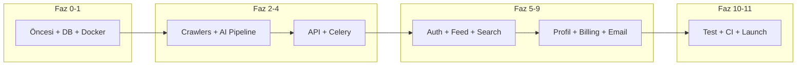

# RegTech Radar — Eksiksiz Todo Listesi

Bu liste [regtech.md](c:\Users\tarik\OneDrive\Masaüstü\projects\RegTech\regtech.md) dosyasındaki **Özellik Matrisi (Bölüm 8)**, **Lansman Kontrol Listesi (Bölüm 14)**, mimari ve dizin yapısına göre türetilmiştir.

---

## Faz 0: Geliştirme Öncesi

- Domain satın al (regtechradar.com / regtechradar.io)
- Stripe hesabı kur; Free / Pro ($29/ay) / Team ($99/ay) ürün ve fiyatları oluştur
- Resend domain doğrulaması yap
- Vercel + Railway veya Fly.io hesapları aç
- GitHub repo oluştur; monorepo scaffold (Turborepo: apps/web, apps/collector, packages/shared)
- `.env.example` oluştur (Bölüm 13’teki tüm değişkenler)
- README.md ve temel dokümantasyon

---

## Faz 1: Altyapı ve Veri Katmanı

- **Monorepo**: Turborepo, `turbo.json`, root `package.json`; `apps/web`, `apps/collector`, `packages/shared` yapısı
- **Database**: PostgreSQL 16 + pgvector + pg_trgm; tüm tablolar (sources, raw_contents, regulatory_updates, company_profiles, impact_assessments, alert_rules, digests) ve index’ler (Bölüm 5.1)
- **Migrations**: Alembic (collector) ve Prisma (web) migration’ları
- **Redis**: Celery broker + cache için konfigürasyon
- **Docker**: `docker-compose.yml` (Postgres, Redis, gerekirse local collector)
- **Shared**: `packages/shared` — TypeScript types (regulatory-update, impact, api), constants (domains, jurisdictions — Bölüm 5.2 taxonomy)

---

## Faz 2: Backend — Collector & Kaynaklar

- **Config & registry**: `config.py` (pydantic-settings), `sources/registry.yaml` — 8 kaynak tanımı (EBA, ESMA, FATF, ECB, FCA, FinCEN, BIS, EUR-Lex)
- **Source base**: `sources/base.py` (AbstractSource), `sources/registry.py` (YAML loader)
- **Crawlers (ilk 3)**: EBA, FATF, FCA — `sources/eba.py`, `sources/fatf.py`, `sources/fca.py` (httpx/Playwright, content_selectors)
- **Crawlers (kalan 5)**: ESMA, ECB, FinCEN, BIS, EUR-Lex — aynı pattern
- **Models**: Pydantic modelleri — source, update, impact, user (company profile); DB entity’leri ile uyum
- **Raw storage**: Crawl çıktılarını `raw_contents` tablosuna yazma; `content_hash` ile dedup (Bölüm 5.1)

---

## Faz 3: Backend — İşleme (AI Pipeline)

- **Parser**: HTML/PDF → temiz metin (`processing/parser.py`); pdfplumber, BeautifulSoup4
- **Dedup**: `processing/dedup.py` — content_hash ile tekrar işlemeyi engelleme
- **Classifier**: Domain + update_type + severity atama (`processing/classifier.py`); taxonomy (Bölüm 5.2)
- **Summarizer**: Claude API — short/long summary, key_takeaways, action_items, affected_entities (Bölüm 7.1 prompt şablonları)
- **Impact engine**: Profil–güncelleme eşleşmesi; impact_score 0–100, impact_category, reasoning (Bölüm 7.2)
- **Embedder**: Vectors (Voyage/OpenAI); pgvector’e yazma (V2’de tam kullanım)
- **AI limits**: Max 8K token, rate limit, fallback “pending”, cost/token logging, content_hash cache (Bölüm 7.3)
- **Celery**: `tasks/celery_app.py`, `tasks/crawl.py`, `tasks/process.py`, `tasks/notify.py`; Celery Beat schedule (crawl_frequency per source)

---

## Faz 4: Backend — API ve Servisler

- **FastAPI app**: `main.py`, health route; middleware (CORS, rate limit)
- **Public-style routes**: `api/routes/updates.py`, `api/routes/search.py` (keyword; V2’de semantic)
- **Internal API**: BFF için kullanılacak endpoint’ler — trigger crawl, crawl status, process by raw_id, stats, digest preview/send (Bölüm 9.2)
- **DB layer**: `db/connection.py` (SQLAlchemy async), `db/repositories.py`
- **Delivery**: `delivery/digest.py` (haftalık digest builder), `delivery/webhook.py` (V2 alert webhook)

---

## Faz 5: Frontend — Auth ve Çekirdek

- **Next.js 14**: App Router, TypeScript strict, Tailwind + shadcn/ui
- **Auth**: NextAuth v5 — Email magic link + Google OAuth; `app/(auth)/login`, `app/(auth)/signup`
- **Layout**: Dashboard layout; `Navbar`, `Sidebar`, `Footer` (shared components)
- **Landing page**: `app/page.tsx` — conversion-odaklı marketing sayfası
- **Lib**: `lib/auth.ts`, `lib/db.ts` (Prisma), `lib/api-client.ts` (backend API client)

---

## Faz 6: Frontend — Feed ve Arama

- **Feed**: `app/(dashboard)/feed` — filtreleme (domain, jurisdiction, severity), sıralama, pagination
- **Components**: `UpdateCard`, `ImpactBadge`, `SourceTag`, `FilterBar`
- **Update detail**: Tek güncelleme detay sayfası (summary_long, takeaways, action_items, link to original)
- **Search**: `app/(dashboard)/search` — keyword search (PostgreSQL full-text); `SearchBar`, `ResultsList`
- **API routes**: `app/api/feed`, `app/api/search` (BFF → Python backend)

---

## Faz 7: Frontend — Profil ve Etki

- **Company profile**: `app/(dashboard)/settings/profile` — wizard: license_types, jurisdictions, domains, entity_size, services (Bölüm 5.1 company_profiles)
- **Impact**: `app/(dashboard)/impact` — kişiselleştirilmiş etki listesi; impact_score, reasoning, recommended_actions
- **Impact API**: Güncelleme bazlı etki skoru (profil ile eşleşme)

---

## Faz 8: Frontend — Ayarlar, Faturalandırma, Email

- **Settings**: `app/(dashboard)/settings` — profile, billing, team (skeleton; Team plan V2)
- **Billing**: Stripe Checkout (Pro/Team), Customer Portal; `app/api/webhooks/stripe`; Free (5 özet/hafta) vs Premium limitleri
- **Email**: Resend + React Email — `WeeklyDigest.tsx`, `BreakingAlert.tsx`; `lib/resend.ts`
- **Digest job**: Haftalık digest oluşturma ve gönderme (Celery task + internal API)

---

## Faz 9: Alerts ve V2 Hazırlık (MVP Sınırında)

- **Alerts (MVP sınırı)**: `alert_rules` tablosu ve 1 adet basit alert (Free plan); `app/(dashboard)/alerts` — AlertList (read-only veya basit kural)
- **AlertRuleBuilder**: V2’de tam; MVP’de isteğe bağlı basit form

---

## Faz 10: Kalite, Güvenlik ve DevOps

- **Backend tests**: pytest + pytest-asyncio; unit (parser, classifier, dedup), integration (crawlers with fixtures), AI golden set (Bölüm 12.4)
- **Frontend tests**: Kritik akışlar için E2E (signup → profile → feed)
- **Linting**: Python ruff (format + check), TypeScript ESLint + Prettier (Bölüm 12.1)
- **CI/CD**: `.github/workflows/ci.yml`, `deploy-web.yml`, `deploy-collector.yml`
- **Güvenlik**: Rate limiting, input sanitization, secrets (.env), robots.txt saygısı, GDPR silme (Bölüm 12.3)
- **Monitoring**: Sentry, Axiom (env ile); uptime/alerting

---

## Faz 11: Lansman

- **Seed data**: 50+ regulatory update (son 2 hafta simülasyonu) ile DB doldur
- **İlk digest**: Beta kullanıcılara haftalık digest gönder
- **Yasal**: GDPR privacy policy, Terms of Service
- **Pazarlama**: Product Hunt hazırlığı, LinkedIn duyurusu
- **Beta**: 3 beta müşteri onayı (testimonial)

---

## V2 (Faz 2 — +4 hafta) — Referans Todo’lar

- Semantic search (pgvector); `ENABLE_SEMANTIC_SEARCH=true`
- Custom alert rules (AlertRuleBuilder); domain + severity + keyword; webhook/Slack
- Regulatory timeline/calendar: `app/(dashboard)/timeline`, `RegulatoryTimeline.tsx`
- Team plan: Çoklu kullanıcı, shared workspace, API anahtarı; `GET /v1/*` public API
- Webhook notifications: `ENABLE_WEBHOOKS=true`, `delivery/webhook.py`
- PDF rapor export (aylık özet)
- Bookmark & notes (güncelleme bazlı)
- i18n (TR + EN)

---

## Özet Akış

Tüm maddeler [regtech.md](c:\Users\tarik\OneDrive\Masaüstü\projects\RegTech\regtech.md) içindeki özellik matrisi (Bölüm 8), lansman kontrol listesi (Bölüm 14), mimari (Bölüm 2–4), veri modeli (Bölüm 5) ve dizin yapısı (Bölüm 4) ile uyumludur.